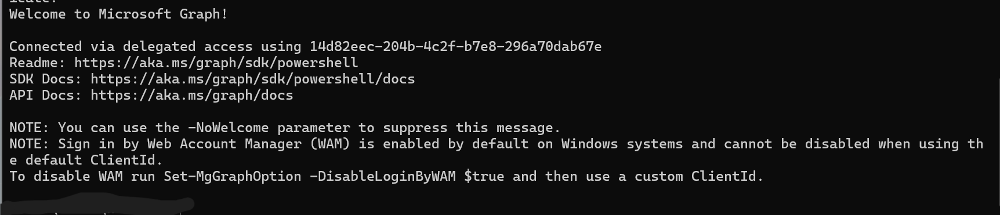
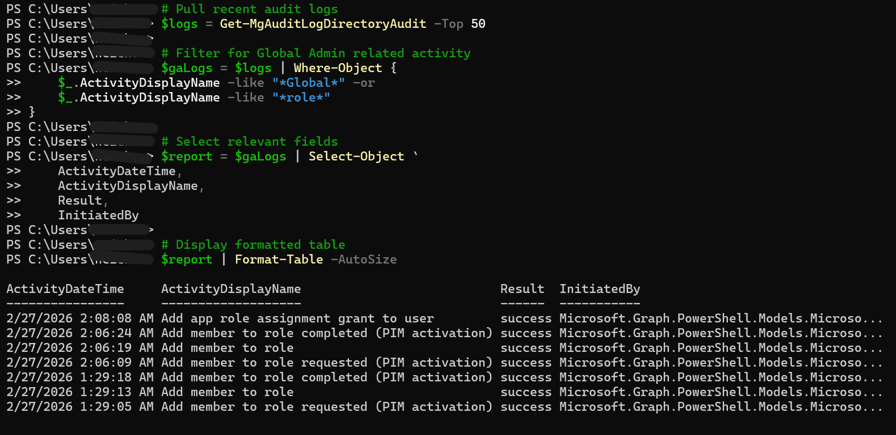
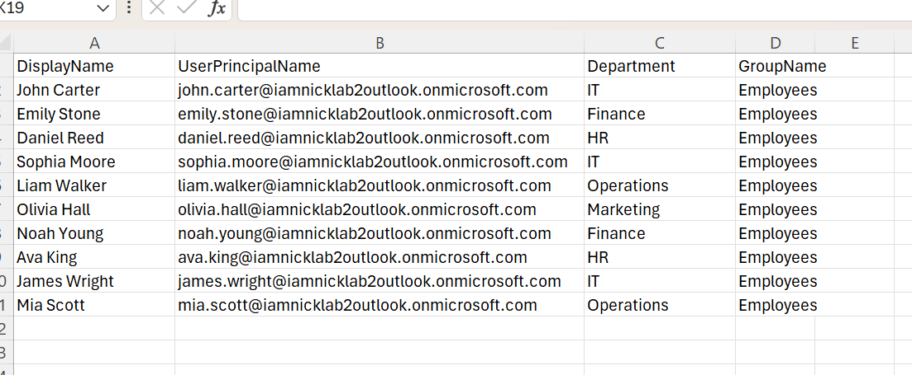
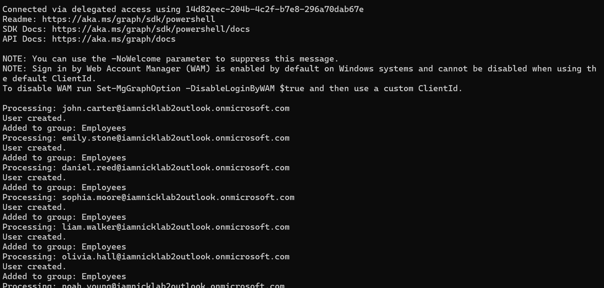
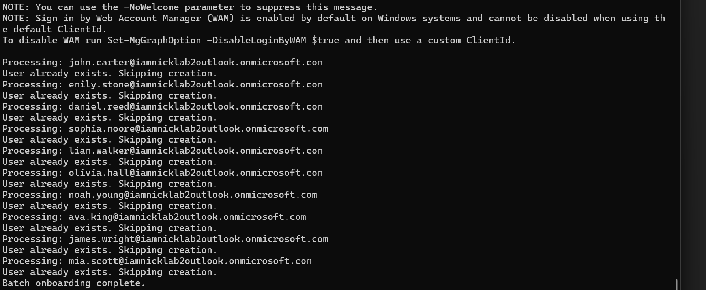
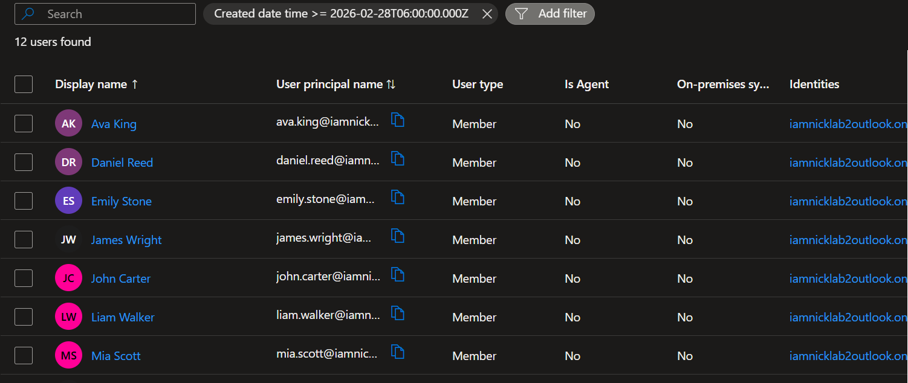
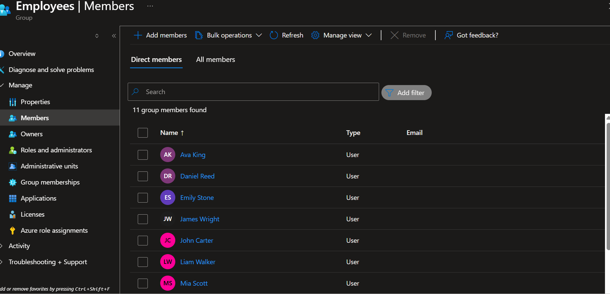

# Microsoft Entra ID Automation & Lifecycle Lab

## Overview

This project demonstrates both privileged access governance and identity lifecycle automation in Microsoft Entra ID using Microsoft Graph PowerShell.

Phase 1 focuses on least-privilege architecture using Privileged Identity Management (PIM) and Conditional Access to monitor privileged activity.

Phase 2 extends the lab into bulk identity lifecycle automation using a CSV-driven HR intake model to simulate enterprise onboarding workflows.

---

# Phase 1 – Privileged Access Governance & Audit Automation

## Architecture Implemented

- Break-glass Global Administrator account (excluded from Conditional Access)
- Role-assignable privileged security group
- Eligible Global Administrator role via PIM (Just-In-Time activation)
- Conditional Access enforcement during privileged elevation
- Delegated Microsoft Graph authentication
- Privileged activity monitoring and automated CSV reporting

---

## Privileged Access Workflow

1. User added as **Eligible** to a role-assignable group
2. User activates Global Administrator via PIM (time-bound access)
3. Conditional Access enforces security controls
4. Activity logged in Entra directory audit logs
5. PowerShell automation retrieves and exports privileged events

---

## Audit Automation

The PowerShell script:

- Connects to Microsoft Graph using delegated permissions
- Retrieves directory audit logs
- Filters privileged role activity
- Selects relevant event properties
- Exports a timestamped CSV audit report

---

## Example Output

The script exports reports in the format:

`Privileged_Audit_Report_YYYY-MM-DD_HH-MM-SS.csv`

This enables repeatable audit generation and compliance review support.

---

## Screenshots – Privileged Access Automation

### Microsoft Graph Connection

---

### Filtered PIM Audit Output

---

### CSV Export Confirmation

---

# Phase 2 – Identity Lifecycle Automation (Bulk Onboarding)

## Overview

This phase simulates enterprise-grade identity lifecycle automation using Microsoft Graph PowerShell.

It implements a CSV-driven HR intake model to provision users in bulk with:

- Automated account creation
- Department assignment
- Group-based RBAC
- Idempotent execution (safe reprocessing)
- Structured batch logging

This models real-world IAM onboarding workflows.

---

## Bulk Onboarding Architecture

- CSV-based HR feed ingestion
- Microsoft Graph user provisioning
- Conditional existence checks (idempotency)
- Automatic group assignment
- Timestamped operational logging

---

## CSV Intake Model

The onboarding engine consumes a structured HR-style CSV file:

Columns:

- DisplayName  
- UserPrincipalName  
- Department  
- GroupName  

This simulates an enterprise HR provisioning feed.

---

## Batch Onboarding Execution

The script performs:

1. Microsoft Graph authentication
2. User existence validation
3. Conditional creation logic
4. Group membership assignment
5. Structured batch logging

---

## User Already Exists Re-Run Behavior

If executed again, existing users are safely skipped to prevent duplication.

---

## Entra ID Validation

Bulk provisioned users visible in Entra Admin Center:

---

## Group Assignment Validation

Users automatically assigned to the Employees security group:

---

## Logging Output

Batch execution generates structured logs for operational review and auditing.

---

# Technologies Used

- Microsoft Entra ID
- Privileged Identity Management (PIM)
- Conditional Access
- Microsoft Graph PowerShell SDK
- CSV-based HR intake modeling
- Bulk identity provisioning
- Idempotent automation logic
- Structured lifecycle logging

---

## Author

Nicholas Cichon
